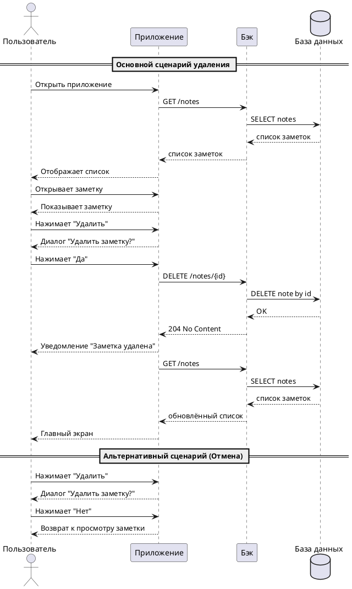

# Пользовательский сценарий «Удаление заметки»

## Действующие лица

1. Пользователь.  

2. Приложение.  

3. Бэк.  

4. База данных.  

## Предварительные условия
- Пользователь находится на главном экране приложения.  
- В системе существует хотя бы одна сохранённая заметка.

## Выходные условия
- Выбранная заметка удалена из системы.  
- Заметка больше не отображается в списке заметок пользователя.

---

## Основной сценарий

1. Пользователь открывает приложение.

2. Приложение отображает список заметок.  

3. Пользователь выбирает и открывает нужную заметку. 

4. Приложение отображает заметку в режиме просмотра. 

5. Пользователь нажимает кнопку **Удалить**.  

6. Приложение отображает диалоговое окно «Удалить заметку?».

7. В диалоговом окне пользователь нажимает кнопку **Да!**.

8. Приложение отправляет запрос 'DELETE http://notesapp.su/api/notes/{id}' Бэку на удаление заметки.  

9. Бэк отправляет запрос в Базу данных на удаление заметки.  

10. База данных удаляет заметку и возвращает Бэку ответ об успешном удалении. 

11. Бэк возвращает Приложению ответ 204 «Заметка успешно удалена».  

12. Приложение отображает пользователю уведомление «Заметка успешно удалена».  

13. Приложение обновляет список заметок и открывает главный экран.

---

## Альтернативный сценарий (Отмена удаления)

1. Пользователь открывает приложение.

2. Приложение отображает список заметок.  

3. Пользователь выбирает и открывает нужную заметку. 

4. Приложение отображает заметку в режиме просмотра. 

5. Пользователь нажимает кнопку **Удалить**.  

6. Приложение отображает диалоговое окно **Удалить заметку?**.

7. В диалоговом окне пользователь нажимает кнопку **Нет!**.

8. Приложение отображает список заметок.  

9. Пользователь нажимает **Мои заметки**.

10. Приложение возвращает пользователя к просмотру заметки.

---

## Диаграмма последовательности

